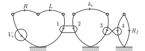
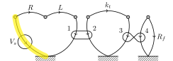
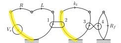
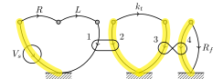
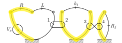
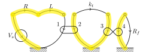

# System Dynamics Tutorial

## Purpose

The purpose of this tutorial is to give the necessary background information on how to use the StateMint software to those who have some experience with system dynamics but may need a refresher, or are not familiar with the linear graph method.

## Background Information

This method of finding a differential equation of a dynamic system works with multiple energy domains and any combination of these domains.

### System Types

In each energy domain a through and an across variable is defined.
Through variables are chosen as those whose value remains constant through a given element.
Across variables are those whose value is relative and changes through an element.
A list of system types and their through and across variables can be found below.

| System Type   | Across                   | Through        |
| ------------- | ------------------------ | -------------- |
| Translational | Velocity                 | Force          |
| Rotational    | Angular Velocity         | Torque         |
| Electrical    | Voltage                  | Current        |
| Fluid         | Pressure                 | Flow Rate      |
| Thermal       | Temperature Differential | Heat Flow Rate |

### Elemental Equations

In each energy domain there are multiple different elements which are used to model a system.
Across energy domains these elements can be grouped into three distinct types.

#### A Type Elements

A type elements are energy storage elements which relates the rate of change of the across variable to the through variable of the element.

| System Type   | Element            | Elemental Equation
| ------------- | ------------------ | ------------------
| Translational | Mass               | 
| Rotational    | Inertia            | 
| Electrical    | Capacitor          | 
| Fluid         | Fluid Capacitor    | 
| Thermal       | Thermal Capacitance | 

#### T Type Elements

T type elements are energy storage elements which relate the rate of change of the through variable to the across variable of the element.

| System Type   | Element          | Elemental Equation
| ------------- | ---------------- | ------------------
| Translational | Spring           | 
| Rotational    | Torsional Spring | 
| Electrical    | Inductor         | 
| Fluid         | Inertance        | 

#### D Type Elements

D type elements are strictly dissipative with a linear relationship between through and across variables.

| System Type   | Element            | Elemental Equation
| ------------- | ------------------ | ------------------
| Translational | Damper             | 
| Rotational    | Rotational Damper  | 
| Electrical    | Resistor           | 
| Fluid         | Fluid Resistance   | 
| Thermal       | Thermal Resistance | 

#### Transformers

In dynamic systems energy can flow between multiple domains.
Transformers are one tool used to model this by relating the through and across variables to each other,

![$\left[\begin{array}{c}v_1\\f_1\end{array}\right]=\left[\begin{array}{cc}TF&0\\0&-1/TF\end{array}\right]\left[\begin{array}{c}v_2\\f_2\end{array}\right]$](http://latex.codecogs.com/svg.latex?%5Cleft%5B%5Cbegin%7Barray%7D%7Bc%7Dv_1%5C%5Cf_1%5Cend%7Barray%7D%5Cright%5D%3D%5Cleft%5B%5Cbegin%7Barray%7D%7Bcc%7DTF%260%5C%5C0%26-1/TF%5Cend%7Barray%7D%5Cright%5D%5Cleft%5B%5Cbegin%7Barray%7D%7Bc%7Dv_2%5C%5Cf_2%5Cend%7Barray%7D%5Cright%5D)

Here  can be used in many different applications.
A few of these are listed below,

| Element                | 
| ---------------------- | ----
| Rack & Pinion          | 
| Gear train             | 
| DC Motor               | 
| Lever                  | 
| Belt Drive             | 
| Electrical transformer | 
| Fluid Transformer      | 

#### Gyrators

Gyrators are another tool used to model energy flow between domains.
This model relates across variables in one domain to through variables in the other,

![$\left[\begin{array}{c}v_1\\f_1\end{array}\right]=\left[\begin{array}{cc}0&GY\\-1/GY&0\end{array}\right]\left[\begin{array}{c}v_2\\f_2\end{array}\right]$](http://latex.codecogs.com/svg.latex?%5Cleft%5B%5Cbegin%7Barray%7D%7Bc%7Dv_1%5C%5Cf_1%5Cend%7Barray%7D%5Cright%5D%3D%5Cleft%5B%5Cbegin%7Barray%7D%7Bcc%7D0%26GY%5C%5C-1/GY%260%5Cend%7Barray%7D%5Cright%5D%5Cleft%5B%5Cbegin%7Barray%7D%7Bc%7Dv_2%5C%5Cf_2%5Cend%7Barray%7D%5Cright%5D)

The following elements can be modeled as gyrators,

| Element           | 
| ----------------- | ----
| Hydraulic Ram     | 
| Displacement Pump | 

### Linear Graph

Linear graph representations of systems use "nodes" and connecting "branches" to diagram a system.
Each node represents an independent across variable value.
Branches are created for each element in the system.
In non electrical systems A type elements always connect to a ground node.
Arrows on branches point in the direction of decreasing across variable.
Arrows on transformers and gyrators always point towards ground.
An example of a linear graph appears in the Example section of this tutorial.

### Normal Tree

In order to find the primary and secondary variables a normal tree can be constructed.
This normal tree should consist of  branches from the linear graph where  is the number of nodes in the linear graph.
If multiple ground nodes are present in the linear graph they should be counted as a single node.
Since the normal tree must be a tree structure no loops may be created when constructing the normal tree.
To construct the normal tree select branches in the following order.

1. Across variable sources
2. A type elements
3. Transformers and Gyrators (minimizing the number of T type elements in the normal tree)
4. D type elements
5. T type elements

For transformers one branch must be selected, and for gyrators both or neither branches can be selected.
The elements in the normal tree are termed normal tree branches, while the elements not in the normal tree are called normal tree links.

### Primary Variables

Once the normal tree has been created it is trivial to determine the primary and secondary variables. These are defined as,

* Across variables on normal tree branches
* Through variables on normal tree links

For each element the secondary variable is the non primary variable. In other words the secondary variables are,

* Across variables on normal tree links
* Through variables on normal tree branches

### State Variables

The state variables of the system are,

* A type elements on normal tree branches
* T type elements on normal tree links

### Elemental Equations

 elemental equations should be written with the primary variable on the left hand side.
Here  is the number of branches in the linear graph and  is the number of sources.

### Continuity Equations

 continuity equations should be found by drawing a contour around any number of nodes which cuts through exactly one passive (non source) normal tree branch.
For each equation the secondary through variable should be placed on the left hand side, and the sum of the through variable flowing through the contour determined.

### Compatibility Equations

 compatibility equations should be written with the secondary across variable on the left side.
To create these equations calculate the sum of the across variables around the loop created when a normal tree link is added to the normal tree.
Do this for each normal tree link.

## Example

To show how this process works, we will work through the following example.

This system is a voltage source which drives a motor with the given resistance and inductance.
This motor in turn drives a pump through a drive shaft with the given stiffness.
Finally the pump pushes water through a curved pipe of known resistance.

### Linear Graph

This system can be distilled into the linear graph below.

### Normal Tree

To create the normal tree, first the voltage source is selected.

To avoid selecting T type elements (the torsional spring and inductor), The right side of the transformer will be added to the normal tree.

Also adding both sides of the gyrator means that adding the torsional spring would cause a loop to be created.

Next a the motor resistance is added.

Finally to complete the normal tree the motor inductance must be added.

### Primary Variables

The following are primary variables determined using the logic above.

,
,
,
,
,
,
,
,

### Secondary Variables

Given the primary variables above the following are easily determined to be secondary variables.

,
,
,
,
,
,
,
,

### State Variables

From the requirements the following can be found to be the only state variable.

### Elemental Equations

Based on the list of elemental equations the following list of elemental equations can be generated.

* 
* 
* 
* 
* 
* 
* 
* 

### Continuity Equations

To determine the continuity equations the following contours can be drawn.

Using these contours the equations below were constructed.

* 
* 
* 
* 
* 

### Compatibility Equations

By adding each link into the normal tree the equations below were generated.

* 
* 
* 

## Using the Software

Given these equations the state equation could be found by hand, or one of the following tools could be used.

### Web Interface

The web interface is by far the easiest method to perform this algebra,
[statemint.stmartin.edu](http://statemint.stmartin.edu/?%7B%22InVars%22%3A%22Vs%22%2C%22StVarElEqns%22%3A%22tk'%20%3D%20kt%20*%20wk%22%2C%22OtherElEqns%22%3A%22vR%20%3D%20R%20*%20iR%2C%5CnvL%20%3D%20L%20*%20iL'%2C%5Cni1%20%3D%20-Kv%20*%20t2%2C%5Cnw2%20%3D%20Kv%20*%20v1%2C%5Cnw3%20%3D%20Q4%20%2F%20-D%2C%5CnP4%20%3D%20t3%20%2F%20D%2C%5CnQR%20%3D%20PR%20%2F%20Rf%22%2C%22Constraints%22%3A%22iL%20%3D%20i1%2C%5CniR%20%3D%20i1%2C%5Cnt2%20%3D%20-tk%2C%5Cnt3%20%3D%20tk%2C%5CnQ4%20%3D%20QR%2C%5Cnv1%20%3D%20Vs%20-%20vR%20-%20vL%2C%5Cnwk%20%3D%20w2%20-%20w3%2C%5CnPR%20%3D%20P4%22%2C%22OutputVars%22%3A%22QR%22%7D).
This interface allow the equations to be entered and the result found without the need to install software.

### Python

The Python implementation of this software can also be used.
An example continuing this tutorial is [provided](https://github.com/CameronDevine/StateMint/blob/master/python/Example.ipynb).

### Mathematica

Finally, the Mathematica package can be used.
An example using Mathematica is also [provided](https://github.com/CameronDevine/StateMint/blob/master/mathematica/Example.nb).

## Further reading

To learn more about this subject consider reading _System Dynamics: An Introduction_ by Rowell and Wormley.
Also available are course [notes](http://ricopic.one/dynamic_systems/) for a class at St. Martin's university taught by Prof. Rico Picone, along with [recorded](https://www.youtube.com/watch?v=Fd1C-abrpmg&index=22&list=PLtuwVtW88fOcFdJ9xOBn0T5ta_XPMKHKz) lectures.
<!--stackedit_data:
eyJoaXN0b3J5IjpbLTEzNTMxOTAxODZdfQ==
-->
