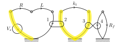

# System Dynamics Tutorial

## Purpose

The purpose of this tutorial is to give the necessary background information on how to use the StateModelRnD software to those who have some experience with system dynamics but may need a refresher, or are not familiar with the method of Rowell and Wormley.

## Background Information

### System Types

| System Type   | Accross                  | Through        |
| ------------- | ------------------------ | -------------- |
| Translational | Velocity                 | Force          |
| Rotational    | Angular Velocity         | Torque         |
| Electrical    | Voltage                  | Current        |
| Fluid         | Pressure                 | Flow Rate      |
| Thermal       | Temperature Differential | Heat Flow Rate |

### Elemental Equations

#### A Type Elements

| System Type   | Element            | Elemental Equation
| ------------- | ------------------ | ------------------
| Translational | Mass               | 
| Rotational    | Inertia            | 
| Electrical    | Capacitor          | 
| Fluid         | Fluid Capacitor    | 
| Thermal       | Thermal Capictance | 

#### T Type Elements

| System Type   | Element          | Elemental Equation
| ------------- | ---------------- | ------------------
| Translational | Spring           | 
| Rotational    | Torsional Spring | 
| Electrical    | Inductor         | 
| Fluid         | Inertance        | 

#### D Type Elements

| System Type   | Element            | Elemental Equation
| ------------- | ------------------ | ------------------
| Translational | Damper             | 
| Rotational    | Rotational Damper  | 
| Electrical    | Resistor           | 
| Fluid         | Fluid Resistance   | 
| Thermal       | Thermal Resistance | 

### Linear Graph

Add each element of the system to the linear graph.
A type elements always connect to the ground.
Arrows point in the direction of decreasing across variable.

### Normal Tree

* Do not create loops
*  branches must be selected

Here  is the number of nodes in the linear graph.

1. Accross variable sources
2. A type elements
3. D type elements
4. T type elements

Normal tree branches are the elements in the normal tree, and links are the elements not in the normal tree.

### Primary Variables

* Across variables on normal tree branches
* Through variables on normal tree links

For each element the secondary variable is the non primary variable.

### State Variables

* A type elements on normal tree branches
* T type elements on normal tree links

### Elemental Equations

 elemental equations should be written with the primary variable on the left hand side.
Here  is the number of branches in the normal tree and  is the number of sources.

### Continuity Equations

 continuity equations should be found by drawing a contour around any number of nodes which cuts thourgh only one branch.
For each equation the secondary through variable should be placed on the left hand side, and the sum of the through variable flowing through the contour listed.

### Compatibility Equations

 compatibility equations should be written with the secondary accross variable on the left side.
To create these equations calculate the sum of the across variables around the loop created when a normal tree link is added to the normal tree.
Do this for each normal tree link.

## Example

To show how this process works, we will work through the following example.

This system is a voltage source which drives a motor with the given resistance and inductance.
This motor in turn drives a pump through a driveshaft with the given stiffness.
Finall the pump pushes water through a curved pipe of known resistance.

### Linear Graph

This system can be distilled into the linear graph below.

### Normal Tree

To create the normal tree, first the voltage source is selected.

To avoid selecting the torsional spring both sides of the gyrator added to the normal tree.

Since one side of the transformer must be added to the normal tree, the left side is added.

Finally to complete the normal tree the motor resistance is added.

### Primary Variables

,
,
,
,
,
,
,
,

### Secondary Variables

,
,
,
,
,
,
,

### State Variables

,

### Elemental Equations

* 
* 
* 
* 
* 
* 
* 
* 

### Continuity Equations

* 
* 
* 
* 
* 

### Compatibility Equations

* 
* 
* 
* 

## Using the Software
